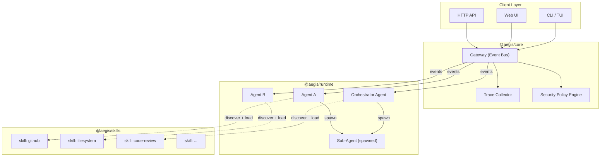
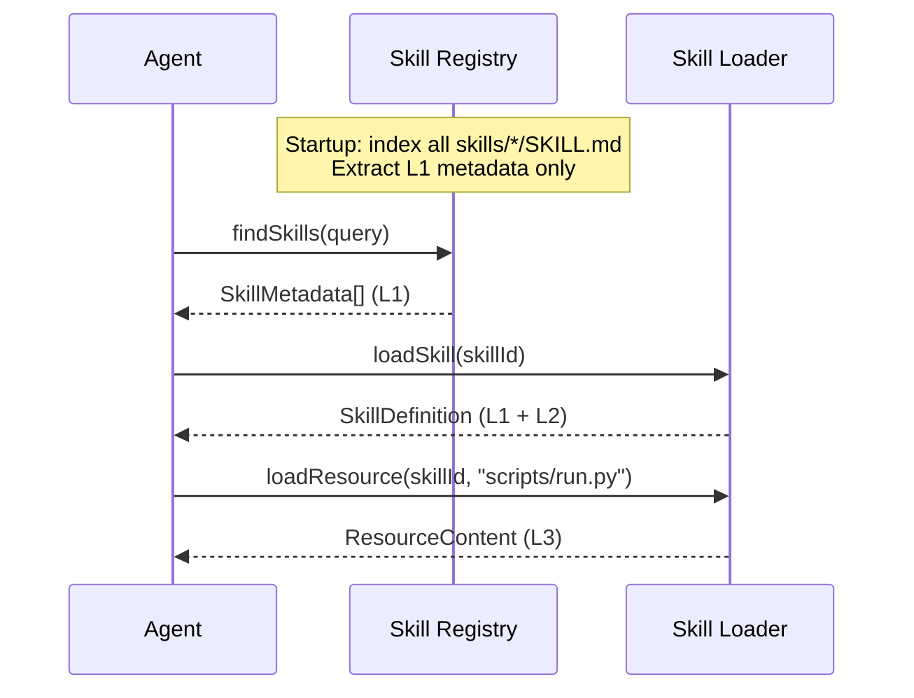
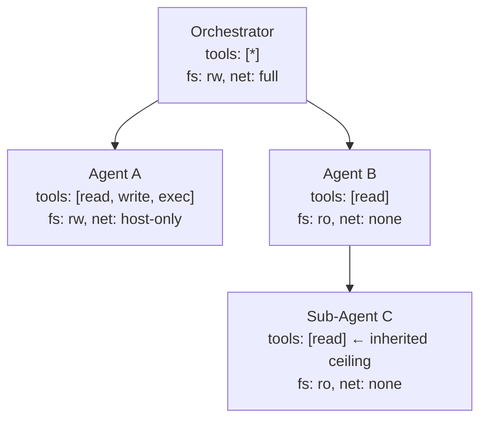
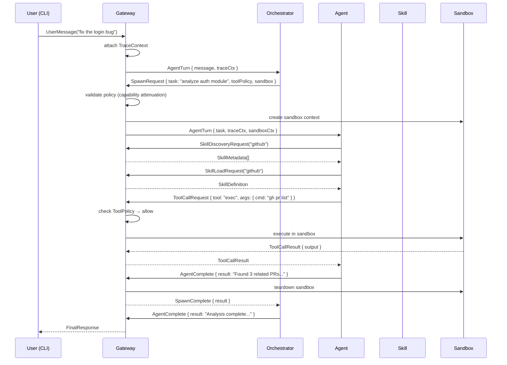

# Project Aegis — Architecture Overview

> A production-grade, local-first agent orchestration platform.

## Core Philosophy

| Principle | Description |
|---|---|
| **Event-Driven Kernel** | The Gateway is a pub/sub event bus. Agents are subscribers, never pollers. |
| **Context Economy** | Skills are lazy-loaded on demand — never pre-loaded into context. |
| **Hierarchical & Recursive** | Sub-agents are a first-class primitive. The Orchestrator is just a root Agent. |
| **Strict Contracts** | All inter-agent communication flows through typed schemas. |
| **Observable by Default** | Every event carries a `traceId` / `spanId` for end-to-end distributed tracing. |

---

## High-Level Architecture



---

## Monorepo Structure (pnpm workspace)

```
aegis/
├── pnpm-workspace.yaml
├── tsconfig.json                    # shared base config
├── vitest.config.ts
│
├── packages/
│   ├── core/                        # @aegis/core — Gateway, Event Bus, Tracing
│   │   ├── src/
│   │   │   ├── gateway/             # Event router, subscription management
│   │   │   ├── bus/                 # Typed pub/sub event bus
│   │   │   ├── security/            # Policy engine, sandbox config
│   │   │   ├── tracing/             # Span/trace context, collector
│   │   │   └── index.ts
│   │   ├── package.json
│   │   └── tsconfig.json
│   │
│   ├── runtime/                     # @aegis/runtime — Agent lifecycle
│   │   ├── src/
│   │   │   ├── agent/               # Agent interface, base implementation
│   │   │   ├── orchestrator/        # Root orchestrator (specialized agent)
│   │   │   ├── subagent/            # Registry, depth limiting, lifecycle
│   │   │   ├── sandbox/             # Container/process isolation
│   │   │   ├── session/             # Session state, persistence
│   │   │   └── index.ts
│   │   ├── package.json
│   │   └── tsconfig.json
│   │
│   ├── skills/                      # @aegis/skills — Skill loader and registry
│   │   ├── src/
│   │   │   ├── loader/              # SKILL.md parser (frontmatter + body)
│   │   │   ├── registry/            # Discovery, indexing, search
│   │   │   ├── executor/            # Script runner, resource resolver
│   │   │   └── index.ts
│   │   ├── package.json
│   │   └── tsconfig.json
│   │
│   └── shared/                      # @aegis/shared — Common types and utils
│       ├── src/
│       │   ├── types/               # All shared TypeScript interfaces
│       │   ├── errors/              # Typed error hierarchy
│       │   ├── utils/               # ID generation, deep-merge, etc.
│       │   └── index.ts
│       ├── package.json
│       └── tsconfig.json
│
├── skills/                          # Skill library (each subdir = one skill)
│   ├── github/
│   │   ├── SKILL.md
│   │   └── scripts/
│   ├── filesystem/
│   │   ├── SKILL.md
│   │   └── references/
│   └── ...
│
├── apps/
│   ├── cli/                         # @aegis/cli — CLI entry point
│   │   ├── src/
│   │   └── package.json
│   └── web/                         # @aegis/web — Web control panel
│       ├── src/
│       └── package.json
│
├── architecture/                    # You are here
│   ├── OVERVIEW.md
│   └── CORE_INTERFACES.ts
│
└── docs/                            # User-facing documentation
```

### pnpm-workspace.yaml

```yaml
packages:
  - packages/*
  - apps/*
  - skills/*
```

---

## Component Breakdown

### 1. Gateway (`@aegis/core`)

The Gateway is the **central nervous system**. It is a typed event bus that:

- Receives inbound requests (CLI, HTTP, WebSocket)
- Routes events to subscribed agents based on topic and filter predicates
- Enforces security policies before dispatching events
- Attaches tracing metadata (`traceId`, `spanId`, `parentSpanId`) to every event
- Persists an append-only event log for replay and debugging

**Key types:** `AegisEvent<T>`, `EventBus`, `Subscription`, `EventFilter`

### 2. Agent Runtime (`@aegis/runtime`)

Agents are the **units of computation**. Each agent:

- **Subscribes** to event topics via the Gateway
- **Receives turns** as structured `AgentTurn` events
- **Emits tool calls** via `ToolCallRequest` events, awaiting `ToolCallResult` responses
- **Spawns sub-agents** via a `SpawnRequest`, receiving a `SpawnHandle` for lifecycle management
- Operates within a **sandbox context** that constrains filesystem, network, and tool access

The **Orchestrator** is a root-level agent with elevated privileges (deeper spawn depth, broader tool access). It is not architecturally special — just a configured agent.

**Key types:** `Agent`, `AgentConfig`, `AgentTurn`, `ToolCallRequest`, `ToolCallResult`, `SpawnRequest`, `SpawnHandle`

### 3. Skill System (`@aegis/skills`)

Skills implement the **Context Economy** — agents only load knowledge when needed.

#### The Three-Level Progressive Disclosure Model

| Level | Loaded When | Size Guideline |
|---|---|---|
| **L1: Metadata** | Always in agent context | `name` + `description` (~100 words) |
| **L2: Instructions** | When skill triggers | SKILL.md body (< 5k words) |
| **L3: Resources** | On-demand by agent | Scripts, references, assets (unlimited) |

#### Skill Discovery Flow



**Key types:** `SkillMetadata`, `SkillDefinition`, `SkillResource`, `SkillRegistry`

### 4. Security Model

> [!CAUTION]
> A sub-agent must **never** be able to destroy the host system. Security is enforced at multiple layers.

#### Layer 1: Tool Policy (allow/deny lists)

Every agent operates under a `ToolPolicy` that specifies which tools it may invoke. Tool calls are intercepted by the Gateway before dispatch:

```typescript
// From CORE_INTERFACES.ts
type ToolPolicy = {
  allow?: string[];   // Whitelist — only these tools permitted
  deny?: string[];    // Blacklist — these tools blocked even if allowed
};
```

Resolution precedence: **explicit deny > explicit allow > default policy**.

#### Layer 2: Sandbox Isolation

Sub-agents run inside sandboxes with configurable isolation levels:

| Sandbox Mode | Filesystem | Network | Process | Use Case |
|---|---|---|---|---|
| `none` | Host (restricted to workspace) | Full | Shared | Trusted first-party agents |
| `workspace` | Workspace-only mount (rw) | Full | Shared | Default for most agents |
| `container` | Docker container (ephemeral) | Host-only | Isolated | Untrusted / elevated risk |
| `locked` | Read-only workspace | None | Isolated | Auditing / read-only tasks |

#### Layer 3: Depth & Resource Limits

```
MAX_SPAWN_DEPTH = 5          // Prevents infinite recursion
MAX_CONCURRENT_CHILDREN = 10 // Per-agent concurrency cap
SPAWN_TIMEOUT_MS = 300_000   // 5-minute default per sub-agent
```

#### Layer 4: Capability Attenuation

A child agent's permissions are a **strict subset** of its parent's. A parent cannot grant capabilities it does not possess. This is enforced at spawn time by the Security Policy Engine.



### 5. Observability

Every `AegisEvent` carries a `TraceContext`:

```typescript
type TraceContext = {
  traceId: string;     // Unique per top-level request
  spanId: string;      // Unique per event
  parentSpanId?: string;
};
```

The trace collector aggregates spans into traces, enabling:

- **Waterfall views** of agent → sub-agent → tool-call chains
- **Latency attribution** per tool/agent
- **Error propagation** tracking across agent boundaries
- **Export** to OpenTelemetry-compatible backends

---

## Event Flow Example



---

## Design Decisions

| Decision | Rationale |
|---|---|
| **Monorepo with pnpm workspaces** | Shared types, atomic version bumps, single CI pipeline. Matches OpenClaw's proven structure. |
| **Gateway as event bus, not RPC** | Decouples agents from each other. Enables fan-out, replay, and middleware (auth, tracing, logging). |
| **Skills as filesystem convention** | No runtime registry server. Skills are `SKILL.md` files discovered by glob. Simple, inspectable, versionable. |
| **Capability attenuation** | Prevents privilege escalation in recursive agent trees. Well-established security pattern (object-capability model). |
| **Docker sandbox as default** | Ephemeral containers provide strong isolation without kernel-level complexity. Falls back to workspace-only on machines without Docker. |
| **OpenTelemetry-compatible tracing** | Industry standard. Agents, tools, and sub-agent trees appear as spans in a single trace. |
